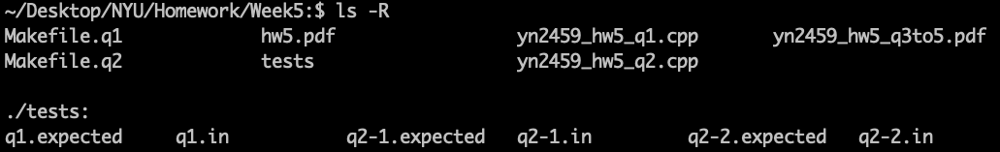
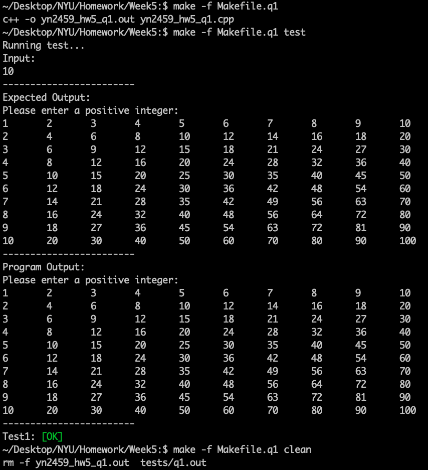
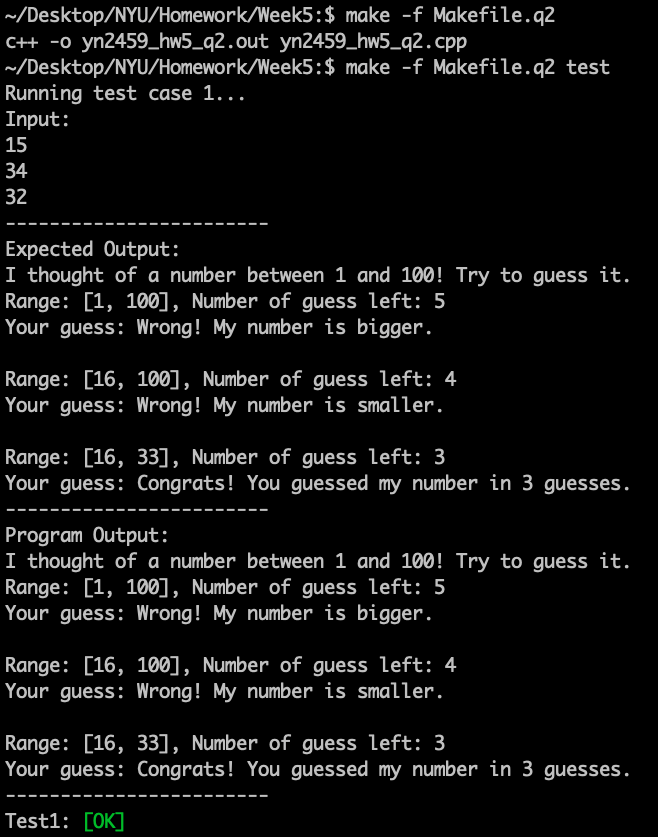
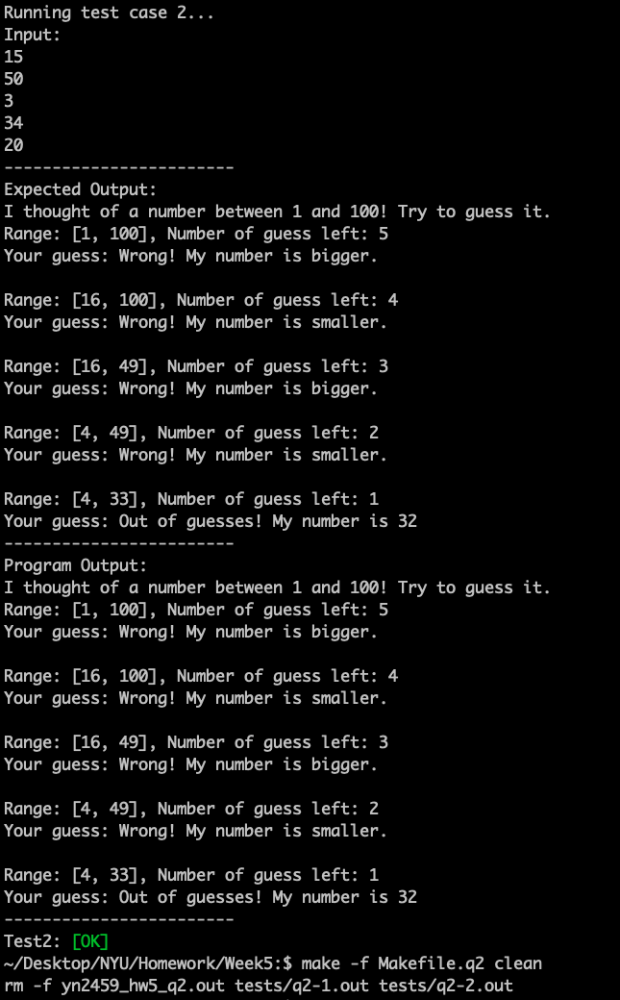

# Week 5 Tester

## Overview
This tester is designed for the Week 5 homework C++ programs. In particular, the Q2 tester requires the `faketime` command and may not work as expected due to the use of random numbers.

## Prerequisites
- **C++ Compiler** (e.g., g++)
- **Make**
- **faketime** (for Q2 testing)
  - On macOS (using Homebrew):
    ```bash
    brew install libfaketime
    ```

## Files Included
- `yn2459_hw5_q2_env.cpp`  
  A modified version of the Q2 source code that uses the environment variable `SEED` to control the random seed. If `SEED` is not set, the program falls back to using `time(0)`.
- `Makefile.q2_env`  
  The Makefile that compiles `yn2459_hw5_q2_env.cpp` and runs tests with fixed `SEED` values.
- **Test Files for Q2:**
  - `q2-1.in` and `q2-1.expected`  
    Input and expected output for test case 1.
  - `q2-2.in` and `q2-2.expected`  
    Input and expected output for test case 2.

## How to Use

### 1. Compile the Tester
Run the following command to compile the program:
```bash
make -f Makefile.q2_env
```

###2. Run the Tests
Execute the tests using:
```bash
make -f Makefile.q2_env test
```
This command runs the tests in a controlled environment where the SEED environment variable is set (inside a subshell) to ensure reproducible results.

###3. Clean Up
To remove compiled binaries and temporary test output files, run:
```bash
make -f Makefile.q2_env clean
```

## Execution Example






